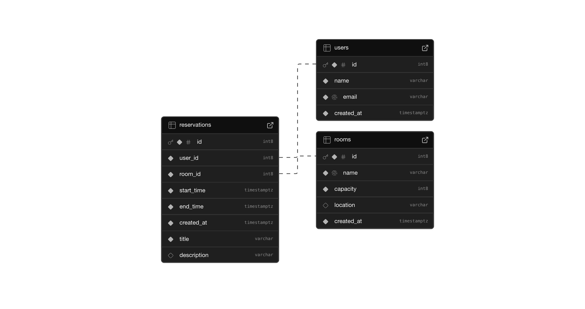

# BookMeeting

Sistema de gerenciamento de reservas de salas de reunião, com backend em **Node.js**, integração com **Supabase** e documentação com **Swagger**.

## Tecnologias Utilizadas

- **Node.js + Express**
- **TypeScript**
- **Supabase**
- **Swagger**

## Estrutura do Projeto

```
src/
├── config/           # Configurações (Supabase, Swagger)
├── controllers/      # Lógica dos endpoints
├── routes/           # Agrupamento de rotas da API
├── services/         # Lógica de negócio e chamadas ao banco
├── types/            # Tipagens e interfaces
├── docs/             # Documentação do Swagger
.env                  # Variáveis de ambiente
```

## Modelo de Dados (UML)

Modelo criado no Supabase:



## Como Rodar o Projeto

1. **Instale as dependências:**

```bash
npm install
```

2. **Inicie o servidor:**

```bash
npm run dev
```
Isso iniciará a API em `http://localhost:3000` e também disponibilizará a documentação Swagger automaticamente.

## Documentação Swagger

A documentação da API está disponível em:

🔗 [http://localhost:3000/api-docs](http://localhost:3000/api-docs)

## Funcionalidades da API

A API está dividida nos seguintes grupos:

### Rooms – Gerenciamento de Salas

| Método | Endpoint                      | Descrição                     |
|--------|-------------------------------|-------------------------------|
| POST   | `/api/rooms/create`           | Criar uma nova sala           |
| GET    | `/api/rooms`                  | Listar todas as salas         |
| GET    | `/api/rooms/{id}`             | Buscar uma sala por ID        |
| DELETE | `/api/rooms/{id}`             | Deletar uma sala por ID       |
| GET    | `/api/rooms/name/{name}`      | Buscar sala pelo nome         |
| PATCH  | `/api/rooms/id/{id}`          | Atualizar sala por ID         |

### Users – Gerenciamento de Usuários

| Método | Endpoint                      | Descrição                     |
|--------|-------------------------------|-------------------------------|
| POST   | `/api/users/create`           | Criar um novo usuário         |
| GET    | `/api/users`                  | Listar todos os usuários      |
| GET    | `/api/users/{id}`             | Buscar usuário por ID         |
| PATCH  | `/api/users/{id}`             | Atualizar usuário por ID      |
| DELETE | `/api/users/{id}`             | Deletar usuário por ID        |

### Reservations – Gerenciamento de Reservas

| Método | Endpoint                                   | Descrição                             |
|--------|--------------------------------------------|----------------------------------------|
| POST   | `/api/reservations/create`                 | Criar uma nova reserva                 |
| GET    | `/api/reservations`                        | Listar todas as reservas               |
| GET    | `/api/reservations/reservation/{id}`       | Buscar reserva por ID                  |
| PATCH  | `/api/reservations/reservation/{id}`       | Atualizar reserva por ID               |
| DELETE | `/api/reservations/reservation/{id}`       | Deletar reserva por ID                 |
| GET    | `/api/reservations/user/{userId}`          | Listar reservas de um usuário          |
| GET    | `/api/reservations/room/{roomId}`          | Listar reservas de uma sala            |
